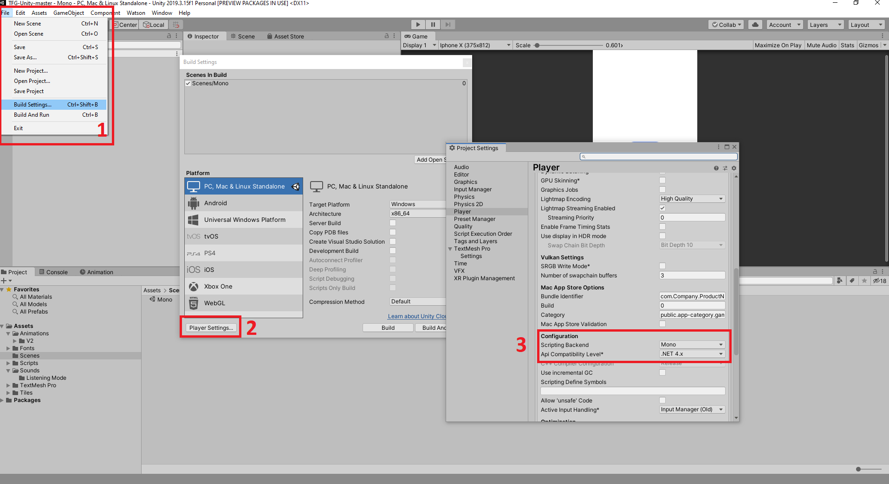
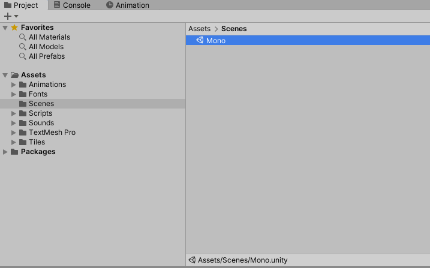
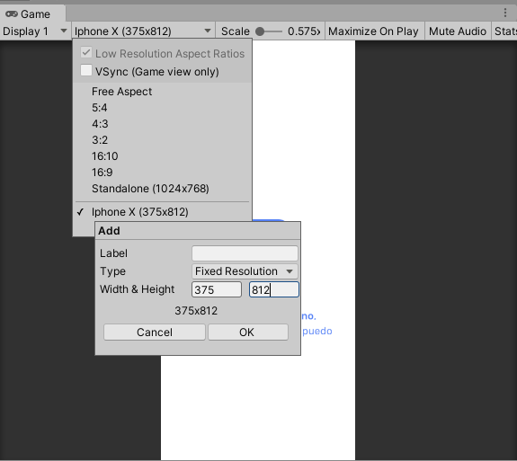
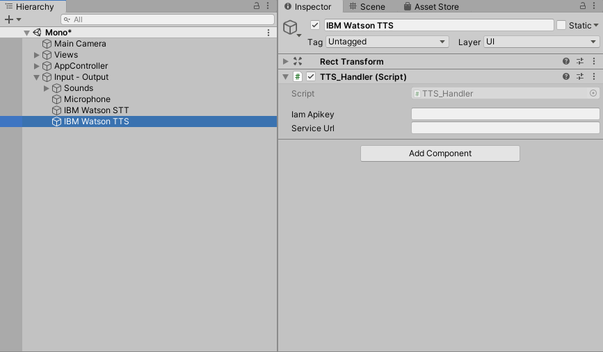
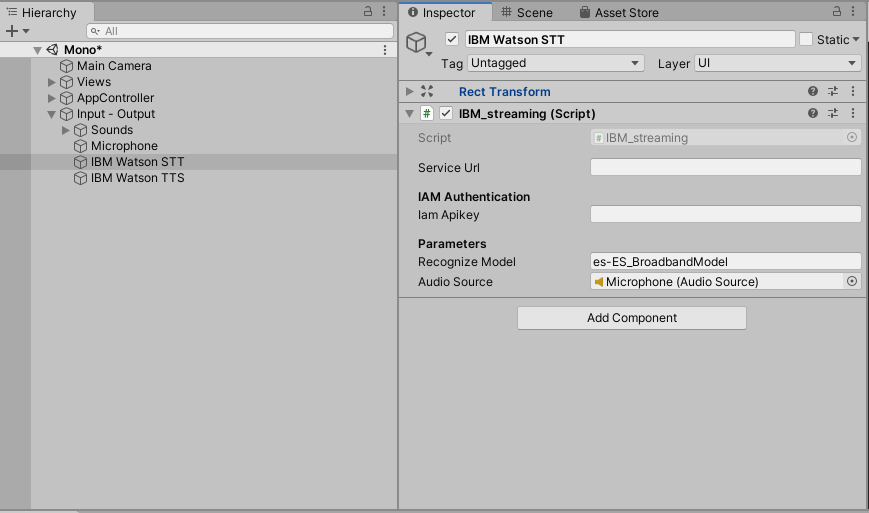

# TFG - Marcos JSP

Este TFG se centra en el diseño de una interfaz de usuario para un agente personal, respetando las mejores técnicas para garantizar una grata experiencia de usuario.

Para lograr este propósito se ha realizado una labor de estudio de la evolución de las interfaces de usuario, y los asistentes virtuales, logrando un mejor entendimiento del éxito y el impacto que tienen estos últimos en la actualidad. Incluso, se exploran diversos artículos, con el objetivo de ofrecer una mejor interacción con el agente.

Además, con propósito de evaluar la interfaz, se ha realizado una encuesta, en la que ha participado, familia, amigos y desconocidos.

El desarrollo de este proyecto recae principalmente sobre la herramienta de diseño y prototipado, Adobe XD, y el entorno de desarrollo Unity (C#).

## Antes de empezar
Es importante asegurarse de que se cumplen los siguientes prerequisitos, para garantizar una correcta ejecución del proyecto:

* Tiene una cuenta [IBM Cloud](https://cloud.ibm.com/registration) y contratar los servicios [Text to Speech](https://cloud.ibm.com/catalog/services/text-to-speech) y [Speech to Text](https://cloud.ibm.com/catalog/services/speech-to-text).
* Ha instalado [Unity Hub](https://store.unity.com/es#plans-individual) en su ordenador.
* Descargar el repositorio y añadirlo a Unity Hub.

## Configuración de Unity
1. Asegurarse de que  **Api Compatibility Level** en `File > Build Settings > Player Settings`, está usando  **.NET 4.x** o equivalente.

   

2. Se ha seleccionado la **escena Mono**, donde se encuentra la implementación de la interfaz en el panel `Project > Assets > Scenes`.

   

3. Se ha seleccionado la **resolución 375x812 (Iphone X)** , en base a la que fue diseñada la interfaz, para obtener una mejor experiencia. Esto se hace en el panel `Game > Aquí iría la resolución seleccionada (por defecto: Free Aspect) > +`.

4. Se introduce la url de servicio y la clave Iam Apikey que ofrece el servicio [Text to Speech](https://cloud.ibm.com/catalog/services/text-to-speech). Una vez se selecciona el GameObject IBM Watson en `Hierarchy > Input-Output`, se pueden introducir estos valores en el panel Inspector, en los parámetros del Script TTS_Handler.

   

   

5. Se repite la operación anterior pero esta vez sobre el GameObject, IBM Watson STT. Esta vez la clave Iam Apikey y la url del servicio vendrá dada por el servicio [Speech to Text](https://cloud.ibm.com/catalog/services/speech-to-text).
   